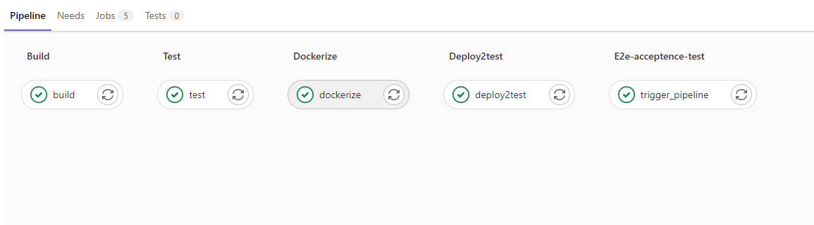
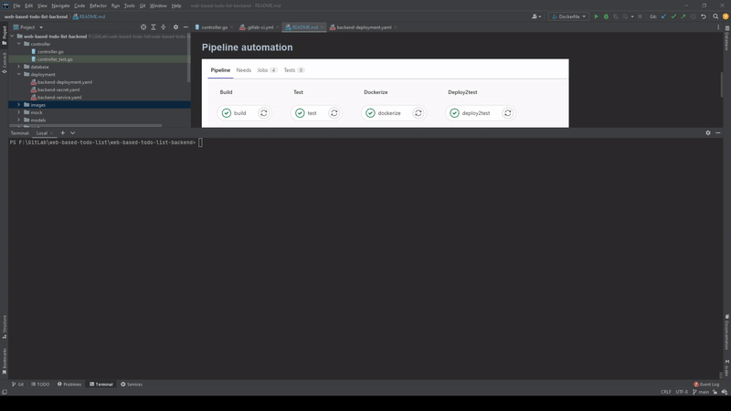

# Web Based ToDo List Application

## Tech Stack

<ol>
<li>GoLang (backend)
    <ol>
        <li>gin (web framework)</li>
        <li>testify (test framework)</li>
        <li>in-memory database</li>
    </ol>
</li>
<li>3-Tier Architecture</li>
<li>RestFULL  Api</li>
<li>Docker</li>
<li>Gitlab CI/CD Pipeline(CI)</li>
<li>Google Cloud Kubernetes</li>
</ol>

## Pipeline automation

## Unit Test

## API URL

GET : http://35.222.60.250/v1/api/todolist

POST : http://35.222.60.250/v1/api/todolist
with body : { todo : "some buy milk"}

